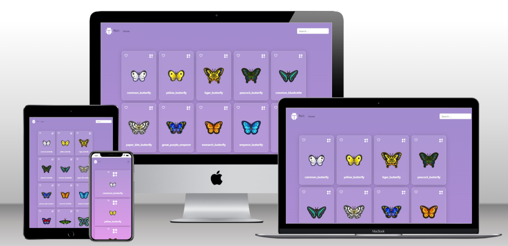

<a name="readme-top"></a>

<div align="center">

  
  <br/>

</div>

<!-- TABLE OF CONTENTS -->

# 📗 Table of Contents

- [📗 Table of Contents](#-table-of-contents)
- [📖 \[Bug Library\] ](#-bug-library-)
  - [🛠 Built With ](#-built-with-)
    - [Tech Stack ](#tech-stack-)
    - [Key Features ](#key-features-)
  - [🚀 Live Demo ](#-live-demo-)
  - [💻 Getting Started ](#-getting-started-)
    - [Prerequisites](#prerequisites)
    - [Setup](#setup)
    - [Install](#install)
    - [Usage](#usage)
    - [Run tests](#run-tests)
    - [Deployment](#deployment)
  - [👥 Authors ](#-authors-)
  - [🔭 Future Features ](#-future-features-)
  - [Contributing](#contributing)
  - [Show your support](#show-your-support)
  - [📝 License](#-license)

<!-- PROJECT DESCRIPTION -->

# 📖 [Bug Library] <a name="about-project"></a>

"Bug Library is for the kid to learn about the bug species and its ability :

- Display all the bug species in Home-page
- Search the bug in the search bar
- when user click the detail btn it will show the details of bug


## 🛠 Built With <a name="built-with"></a>

* HTML/CSS
* JavaScript (ES6/ES7..)
* React.js
* Bootstrap
* React-jest
* Redux
### Tech Stack <a name="tech-stack"></a>

<details>
  <summary>Client</summary>
  <ul>
    <li><a href="https://developer.mozilla.org/en-US/docs/Learn/HTML">HTML</a></li>
    <li><a href="https://developer.mozilla.org/en-US/docs/Learn/CSS">CSS</a></li>
    <li><a href="https://developer.mozilla.org/en-US/docs/Learn/JavaScript">JavaScript (ES6/ES7..)</a></li>
    <li><a href="https://reactjs.org/">React.js</a></li>
  </ul>
</details>


<!-- Features -->

### Key Features <a name="key-features"></a>


- Home page
- Search bar
- Detail page

<p align="right">(<a href="#readme-top">back to top</a>)</p>

<!-- LIVE DEMO -->

## 🚀 Live Demo <a name="live-demo"></a>

Click here to see the [Live Demo](https://react-capstone-project.vercel.app/) of the website 

  

<p align="right">(<a href="#readme-top">back to top</a>)</p>

<!-- GETTING STARTED -->

## 💻 Getting Started <a name="getting-started"></a>

To get a local copy up and running, follow these steps.

### Prerequisites

In order to run this project you need:
* GitHub flow
* Gitflow
* HTML and CSS
* JAVASCRIPT (ES6/...)
* React.js
* npm
* Node.js
* vercel
* Any code editer (vs code)


### Setup

Clone this repository to your desired folder:

```cd https://github.com/soesandarwin2201/react_capstone_project```

### Install

Install this project with:

2. Open the directory of the project
   ```sh
   cd react_capstone_project
   ```
3. Open the directory of the src
   ```sh
   cd src
   ```
4. Open the index.html file
   ```sh
   Click and open the index.html file
   ```

 

### Usage

To run the project, execute the following command:


1. for build ```npm run build```
2. for development ```npm start```

### Run tests

To run tests, run the following command:

```npm test```


### Deployment

You can deploy this project using:

```npm run deploy - Deploys using gh-pages```


<p align="right">(<a href="#readme-top">back to top</a>)</p>

<!-- AUTHORS -->

## 👥 Authors <a name="authors"></a>


👤 Soe Sandar Win

- GitHub: [@soesandarwin2201](https://github.com/soesandarwin2201)
- LinkedIn: [LinkedIn](https://www.linkedin.com/in/soe-sandar-win-softwareengineer/)

<p align="right">(<a href="#readme-top">back to top</a>)</p>

<!-- FUTURE FEATURES -->

## 🔭 Future Features <a name="future-features"></a>

- [ ] Make the heart icon count using api


<p align="right">(<a href="#readme-top">back to top</a>)</p>

##project documentation

- (https://www.loom.com/share/0a02d2c9af74412e8a2bda0a05a50096)

## Contributing

Contributions, issues, and feature requests are welcome!
Feel free to check the [issues page](https://github.com/Abdessittir/math-magicians/issues).

## Show your support
Give a ⭐️ if you like this project!

## 📝 License

This project is [MIT](./MIT.md) licensed.

_NOTE: we recommend using the [MIT license](https://choosealicense.com/licenses/mit/) - you can set it up quickly by [using templates available on GitHub](https://docs.github.com/en/communities/setting-up-your-project-for-healthy-contributions/adding-a-license-to-a-repository). You can also use [any other license](https://choosealicense.com/licenses/) if you wish._

<p align="right">(<a href="#readme-top">back to top</a>)</p>
